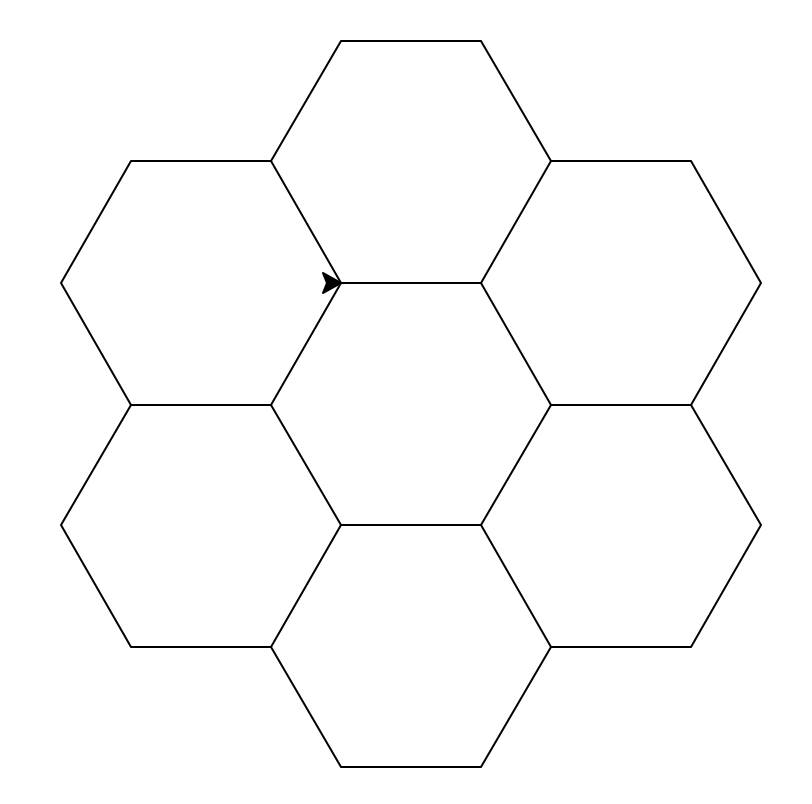

# Domácí úloha č. 1

Termín: 

- skupina 07: 8. 10. 23.59.59
- skupina 08: 8. 10. 23.59.59

Odevzdání: Odevzdávarna v ISu

Dotazy: jan.drabek@mail.muni.cz


# Včelí plástev

**Nakreslete včelí plástev pomocí želví grafiky**




# Přesýpací hodiny

**Napište funkci, která vykreslí plné přesýpací hodiny o zadané šířce:**

```
# # # # # # # # #
  # # # # # # #
    # # # # #
      # # #
        #
      # # #
    # # # # #
  # # # # # # #
# # # # # # # # #
```

# Násobky 29 dělitelné 9

**Napište program, který vytiskne všechny násobky 29 dělitelné 9 menší než 1000.** (Doporučuji si připomenout definici dělitelnosti ;-)


# Rekurentní posloupnost

**Vypište prvních 20 položek následující posloupnosti:**

```
r_0 = 2
r_1 = 3
r_n = 4 * r_(n-1) + r_(n-2)
```

(Lidsky řečeno: n-tá položka = 4 * předchozí + předpředchozí. Nultá je 2, první je 3.)

# Soudělnost

**Napište funkci, která vypíše tabulku s daným počtem řádků a sloupců (+ popisný řádek a sloupce), kde v každé buňce se nachází `T` nebo `F` podle toho, zda je číslo řádku dělitelné číslem sloupce.**
